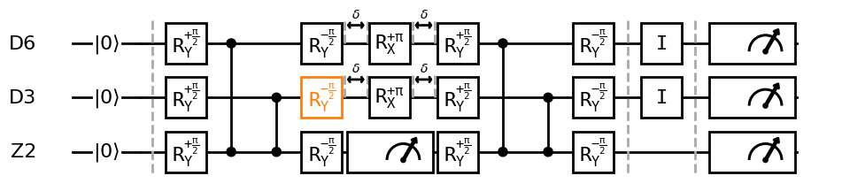
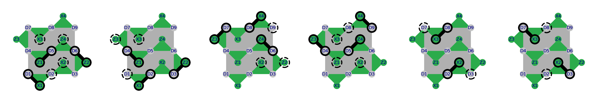
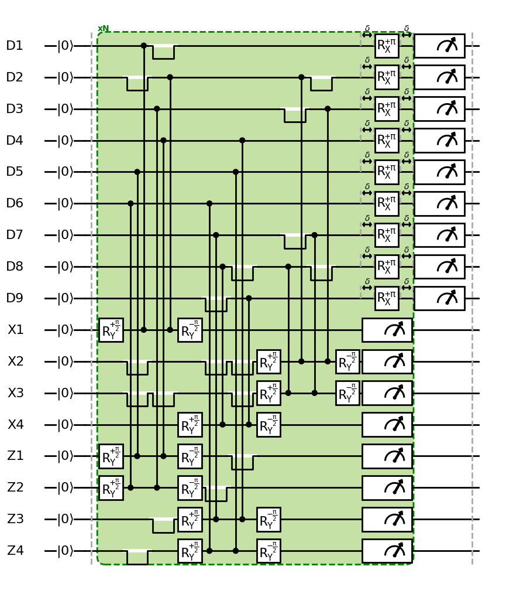
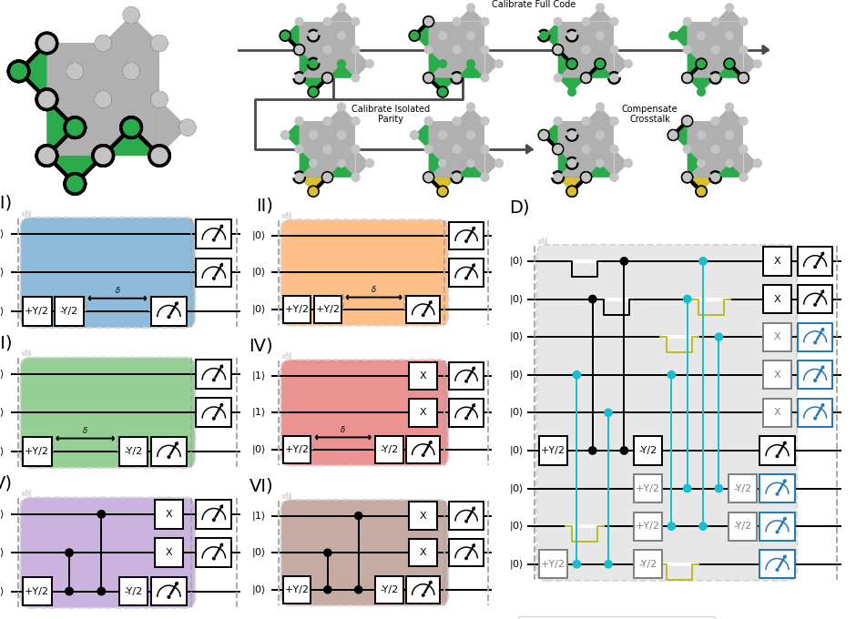

# QCoCircuits
`qce_circuit` is a Python package designed for the visualization of quantum circuits, with a particular focus on error correction circuits and device layouts.

## Repository Structure

The package is organized into four main sections:

1.  **Quantum Circuit Construction:** A declarative language for building quantum circuits, similar in style to popular packages like Qiskit and Quantify.
2.  **Device Layout Framework:** A framework to describe arbitrary device layouts, with specific utilities for surface-code devices.
3.  **Visualization Framework:** A powerful tool that translates the quantum circuit language into high-quality Matplotlib visualizations using draw-component factories and customizable style settings.
4.  **Addon Functionality:** Includes supplementary features like circuit translation to Stim and OpenQL.

## Examples

Here are a couple of examples to get you started.

### Simple Circuit

This example demonstrates the basic functionality of the package, including the addition of gates, the use of `RelationLinks` to define the timing of operations, and the plotting of the final circuit.

```python
from qce_circuit import (
    DeclarativeCircuit,
    FixedDurationStrategy,
    Ry90,
    Rym90,
    CPhase,
    Wait,
    DispersiveMeasure,
    Rx180,
    Barrier,
    Identity,
    RelationLink,
    RelationType,
    InitialStateEnum,
    plot_circuit,
)
from qce_circuit.structure.circuit_operations import (
    VirtualColorOverwrite,
)

# Circuit construction
circuit = DeclarativeCircuit()
circuit.add(Barrier([0, 1, 2]))
circuit.add(Ry90(0))
circuit.add(Ry90(1))
circuit.add(Ry90(2))
circuit.add(CPhase(2, 0))
circuit.add(CPhase(2, 1))
relation = RelationLink(circuit.get_last_entry(), RelationType.FOLLOWED_BY)
circuit.add(Rym90(0, relation=relation))
circuit.add(VirtualColorOverwrite(Rym90(1, relation=relation), color_overwrite="C1"))
circuit.add(Rym90(2, relation=relation))

relation = RelationLink(circuit.get_last_entry(), RelationType.FOLLOWED_BY)
# Ancilla measurement
for ancilla_index in [2]:
    circuit.add(DispersiveMeasure(
        ancilla_index,
        acquisition_strategy=circuit.get_acquisition_strategy(),
        acquisition_tag='parity',
        relation=relation,
    ))
dynamical_decoupling_wait = FixedDurationStrategy(duration=0.5)
for data_index in [0, 1]:
    circuit.add(Wait(data_index, duration_strategy=dynamical_decoupling_wait, relation=relation))
    circuit.add(Rx180(data_index))
    circuit.add(Wait(data_index, duration_strategy=dynamical_decoupling_wait))
relation = RelationLink(circuit.get_last_entry(), RelationType.FOLLOWED_BY)

circuit.add(Ry90(0, relation=relation))
circuit.add(Ry90(1, relation=relation))
circuit.add(Ry90(2, relation=relation))
circuit.add(CPhase(2, 0))
circuit.add(CPhase(2, 1))
relation = RelationLink(circuit.get_last_entry(), RelationType.FOLLOWED_BY)
circuit.add(Rym90(0, relation=relation))
circuit.add(Rym90(1, relation=relation))
circuit.add(Rym90(2, relation=relation))

circuit.add(Barrier([0, 1, 2]))
circuit.add(Identity(0))
circuit.add(Identity(1))
circuit.add(Barrier([0, 1, 2]))

# Data measurement
for qubit_index in [0, 1, 2]:
    circuit.add(DispersiveMeasure(
        qubit_index,
        acquisition_strategy=circuit.get_acquisition_strategy(),
        acquisition_tag='final',
    ))

# Define qubit mapping and initial states
channel_map = {
    i: name
    for i, name in enumerate(['D6', 'D3', 'Z2'])
}
circuit.set_qubit_initial_state(0, InitialStateEnum.ZERO)
circuit.set_qubit_initial_state(1, InitialStateEnum.ZERO)
circuit.set_qubit_initial_state(2, InitialStateEnum.ZERO)

# Plot the circuit
figsize_setting = (9, 3)
fig, ax = plot_circuit(
    circuit,
    channel_map=channel_map,
    figsize=figsize_setting,
)
```


### Repetition Code

This example showcases a more advanced feature, using the `RepetitionCodeDescription` factory to construct a repetition code circuit. This is particularly useful for visualizing error correction circuits.

```python
from qce_circuit import (
    DeclarativeCircuit,
    plot_circuit,
)
from qce_circuit.library.repetition_code.circuit_constructors import (
    RepetitionCodeDescription,
    construct_repetition_code_circuit_simplified,
)
from qce_circuit.library.repetition_code.repetition_code_connectivity import (
    Repetition9Round6Code,
    QubitIDObj,
)
from qce_circuit.visualization.visualize_layout.display_connectivity import (
    plot_stabilizer_specific_gate_sequences,
)


# Define the circuit description from connectivity
circuit_description = RepetitionCodeDescription.from_connectivity(
    involved_qubit_ids=[
        QubitIDObj('D1'), QubitIDObj('X1'), QubitIDObj('D2'),
        QubitIDObj('X2'), QubitIDObj('D3'), QubitIDObj('Z2'),
        QubitIDObj('D6'), QubitIDObj('Z4'), QubitIDObj('D5'),
        QubitIDObj('Z1'), QubitIDObj('D4'), QubitIDObj('Z3'),
        QubitIDObj('D7'), QubitIDObj('X3'), QubitIDObj('D8'),
        QubitIDObj('X4'), QubitIDObj('D9'),
    ],
    connectivity=Repetition9Round6Code()
)

# Construct the circuit
channel_order, channel_map = circuit_description.get_channel_order_and_mapping()
root_circuit: DeclarativeCircuit = construct_repetition_code_circuit_simplified(
    qec_cycles='N',
    description=circuit_description,
)

# Plot the circuit and stabilizer sequences
plot_stabilizer_specific_gate_sequences(Repetition9Round6Code())
plot_circuit(circuit=root_circuit, channel_order=channel_order, channel_map=channel_map, figsize=(10, 10))
```



### Additional Examples

